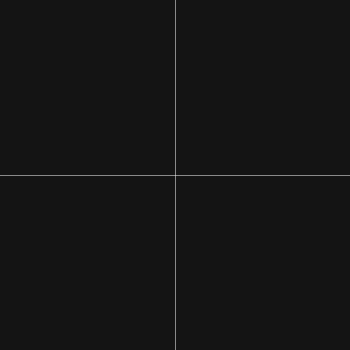

# Processing
Playing with Processing programming language 

Processing is a software sketchbook and a language for learning how to code within the context of the visual arts

## BasicStar
It's an star made with lines, I really recommend to try draw it on a paper first, it's so gratifying.

  

Cool story: The fist time that I saw this star, I was in philosoph class and my teacher drew it on the board and then asked for my classmates to draw the same star. I couldn't do it for the first time, but I remember spending a whole afternoon trying to remake the same drawing.

